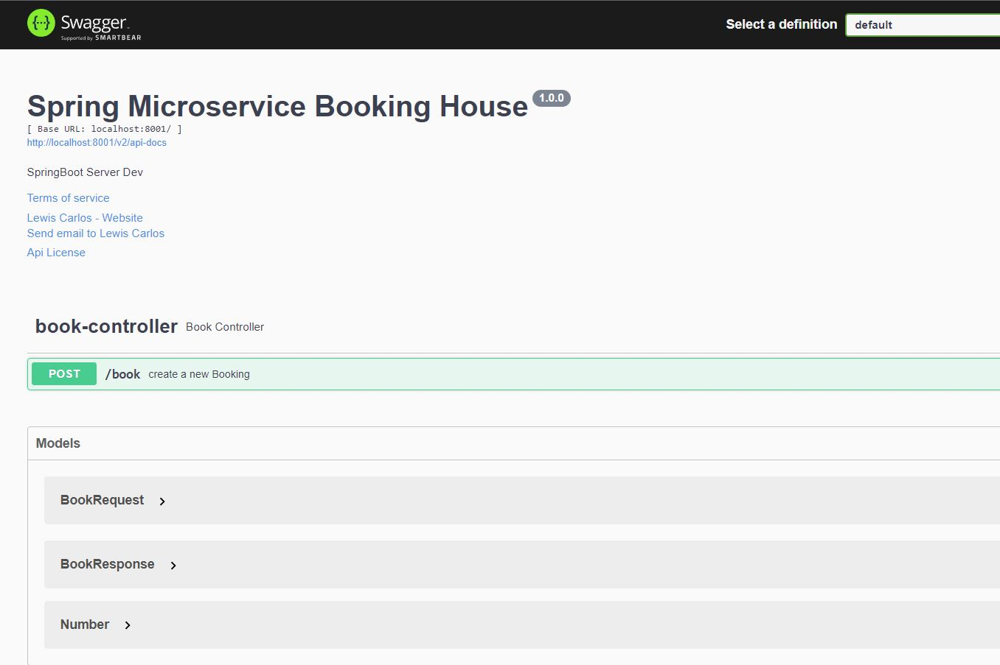
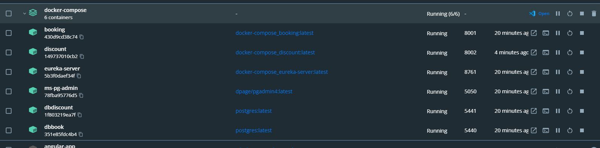
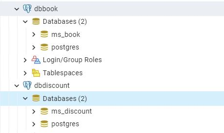
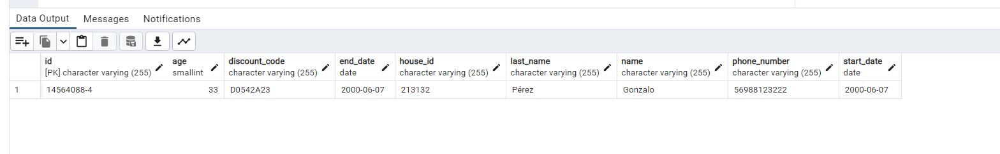

<h1>🖼 Microservice Springboot Booking A House test to company Bidea Factory </h1>  

<h2>Description English</h2>

Goal: Create a rest API that allows you to book a house, for which a request must be received,
validate said request, if a discount code is indicated, validate it through an api rest, and to
Finish saving the request data in a PostgreSQL Database. 

 
<h2>Descrição Português</h2>

Objetivo: Criar uma API rest que permita reservar uma casa, para a qual deve ser recebido um pedido,
validar o referido pedido, se for indicado um código de desconto, validá-lo através de um api rest, e para
Termine de salvar os dados da solicitação em um banco de dados PostgreSQL. 

 

## 🚀 Tech Usada 
 
- Spring Boot 
- Spring Cloud Microserviços  
- Clean Code 
- PostgreSQL  
-   Swagger  
-   Docker - Docker-compose 
- Feign Client 
-   Rest   

 

To run the application follow the video

Aplicação

 
 

Basically you will just need docker installed on your machine, in the "docker-compose" folder run the command
"docker-compose -f docker-compose.yml -f docker-compose.override.yml up -d" Right after the containers are created, wait a while and open the container named "ms-pg-admin"
and create the servers for dbbook and dbdiscount just follow the giveaway that shows how to create the servers in postgreSQL,
soon after, a database with the name "ms_discount" will be automatically created on the dbdiscount server, make a query and execute the following
  command which is in the discount.sql file, then you can test the app by host "http://localhost:8001/swagger-ui/index.html#/"

 

 Or if you prefer if you have Java 11 installed, postgreSQL just run the following applications in order, eureka-server > discount > book
 

Swagger

docker

Database

Book House

## Linkedin Below - Linkedin ABaixo

<h4 align="center">
   Created by   <a href="https://www.linkedin.com/in/luiz-carlos-b50693173/" target="_blank"> Luiz Carlos </a>
</h4>

</html>
