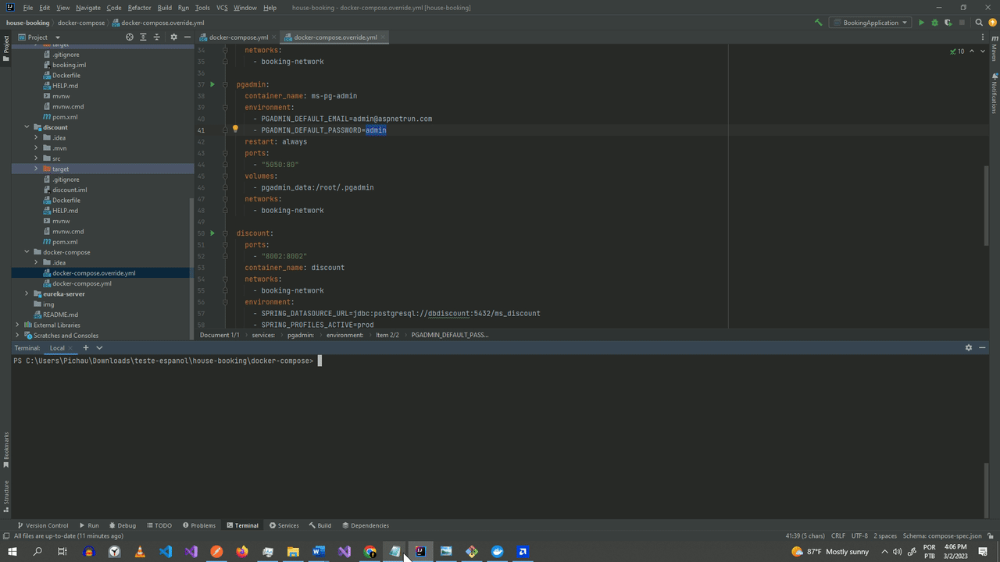

## 🖼 Academia "Gym Corpus" Dashboard Gestão de clientes  

<h2>Descripción</h2>

OBJETIVO : Crear una API rest que permite reservar una casa, para lo cual se debe recibir un request,
validar dicho request, si se indica algún código de descuento validarlo a través de una api rest, y para
finalizar guardar los datos del request en una bbdd postgresql. 

 
## 🚀 Tech Usada 
 
- Spring Boot 
- Spring Cloud Microserviços  
- Clean Code 
- PostgreSQL  
-   Swagger  
-   Docker - Docker-compose 
- Feign Client 
-   Rest   

 

 cómo usar

Login Page

 

## 🖼 Screenshot APPLICATION SCREENS  

Whole application click below to the run video

 
 

Login Page

 
 

chat-screen-page

 
 

Employee Update

 
 

Employee Details

 
 

Employee Delete

 
 

User Details

 
 

User List

 
 

User Update

 
 

User Delete

 
 

## Linkedin Below - Linkedin ABaixo

<h4 align="center">
   Created by   <a href="https://www.linkedin.com/in/luiz-carlos-b50693173/" target="_blank"> Luiz Carlos </a>
</h4>

</html>
